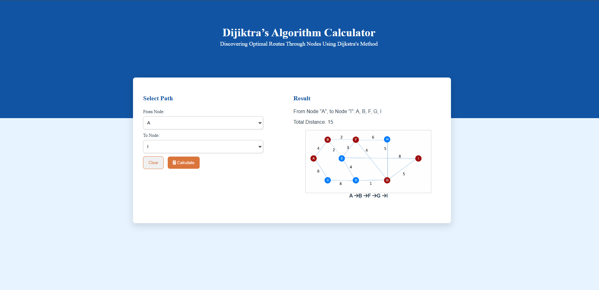
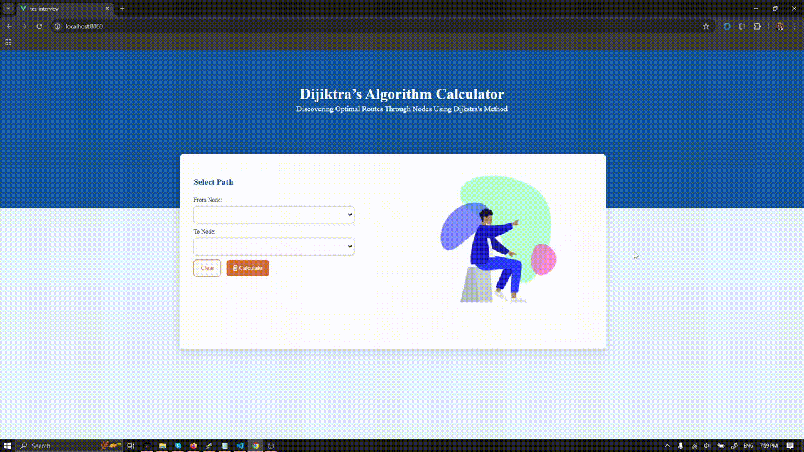

##Project Description

This project is a Dijkstra's Algorithm Visualizer, designed to help users understand the workings of Dijkstra's algorithm through an interactive interface. It aims to provide users with an educational experience by efficiently calculating the shortest path between nodes. Built using Vue.js, this project emphasizes responsiveness and ease of use.

Key Features

  Shortest Path Calculation: Quickly finds the shortest path between selected nodes using Dijkstra's algorithm.
  Interactive Graph Representation: An additional visual component that enhances understanding by displaying the algorithm's process in real time.
  User-Friendly Interface: Simple and intuitive design that caters to users of all levels.
    
## Project setup
```
npm install
```

### Compiles and hot-reloads for development
```
npm run serve
``` 
